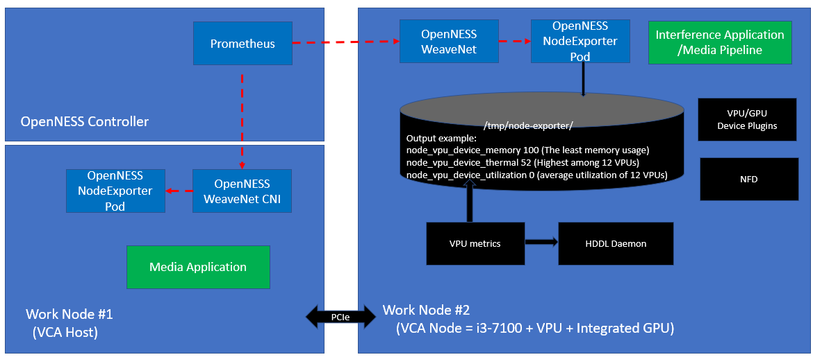
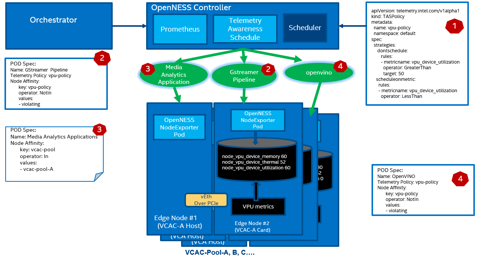

```text
SPDX-License-Identifier: Apache-2.0
Copyright (c) 2020 Intel Corporation
```
<!-- omit in toc -->
# Using Visual Compute Accelerator Card - Analytics (VCAC-A) in OpenNESS
- [Overview](#overview)
- [Architecture](#architecture)
  - [VCA Zone](#vca-zone)
  - [VCA Pools](#vca-pools)
- [Node Feature Discovery (NFD)](#node-feature-discovery-nfd)
- [VPU, GPU Device Plugins, and HDDL Daemonset](#vpu-gpu-device-plugins-and-hddl-daemonset)
- [Telemetry Support](#telemetry-support)
- [Media-Analytics-VCA Flavor](#media-analytics-vca-flavor)
- [References](#references)

## Overview
The Visual Cloud Accelerator Card - Analytics (VCAC-A) equips 2nd Generation Intel® Xeon® processor- based platforms with Iris® Pro Graphics and Intel® Movidius™ VPUs to enhance video codec, computer vision, and inference capabilities. Comprised of one Intel i3-7100U CPU and 12 Intel® Movidius™ VPUs, this PCIe add-in card delivers competent stream inference capability and outstanding total cost of ownership. Provisioning the network edge with VCAC-A acceleration through the OpenNESS Experience Kits (OEK) enables dense and performant media analytics and transcoding pipelines.

## Architecture

Equipped with a CPU, the VCAC-A card is installed with a standalone operating system that is separate from the host server. Thus, the VCAC-A card can be topologically regarded as a standalone "node" with VPU/GPU capabilities. The VCAC-A card is connected to the host Intel® Xeon® platform over a PCIe\* non-transparent bridge (NTB) – over a virtual ethernet network `172.32.x.1/24`. The host kernel must be patched to enable the virtual Ethernet over PCIe.

> **Terminology** 
> * *Edge node* and *VCA host* are used interchangeably throughout this document to represent the physical node where the VCAC-A cards are connected to.
> * *VCA node* represents the  node in the OpenNESS cluster. The VCAC-A card is the incarnation of the VCA node.
> * The full acronym *VCAC-A* is loosely used when talking about the PCIe card.

The VCAC-A installation involves a [two-stage build](https://github.com/OpenVisualCloud/VCAC-SW-Analytics/):
1. VCA host kernel build and configuration: this stage patches the CentOS\* 7.8 kernel and builds the necessary modules and dependencies.
2. VCAC-A system image (VCAD) generation: this stage builds an Ubuntu\*-based (VCAD) image that is loaded on the VCAC-A card.

The OEK automates the overall build and installation process of the VCAC-A card by joining it as a standalone logical node to the OpenNESS cluster. When successful, the OpenNESS controller is capable of selectively scheduling workloads on the "VCA node" for proximity to the hardware acceleration.

When onboarding applications such as [Open Visual Cloud Smart City Sample](https://github.com/otcshare/edgeapps/tree/master/applications/smart-city-app) with the existence of VCAC-A, the OpenNESS controller schedules all the application pods onto the edge node except the *video analytics* processing that is scheduled on the VCA node as shown in the figure below.


_Figure - VCAC-A accelerating Smart City Application with OpenNESS_

### VCA Zone
During the VCAC-A installation, the VCA nodes are labeled with `vcac-zone=yes`. Therefore, to direct the OpenNESS controller to schedule particular workloads on the VCA node, the `nodeAffinity` field should be used in its Pod specs as shown below:

```yaml
...
affinity:
  nodeAffinity:
    requiredDuringSchedulingIgnoredDuringExecution:
      nodeSelectorTerms:
        - matchExpressions:
          - key: "vcac-zone"
            operator: In
            values:
              - "yes"
```

### VCA Pools
Another construct used when deploying OpenNESS is the `VCA pool`, which is a similar concept to the *Node pools* that are supported by [Azure\* Kubernetes\* Service](https://docs.microsoft.com/en-us/azure/aks/use-multiple-node-pools) and [Google\* Kubernetes Engine](https://cloud.google.com/kubernetes-engine/docs/concepts/node-pools). The VCA pool is a unique label assigned to the group of VCA nodes that are plugged into one node. This enables the scheduler to execute related workloads within the same VCA pool (i.e., within the same edge node physical space). The VCA pool is assigned the label `vcac-pool=<vca-host-name>`, which reflects the hostname of the VCA host that all the VCAC-A cards are connected to.

Also, the VCA nodes follow a special naming convention. They are assigned the name of their host nodes appended with *vca* keyword and a number (`<vca-host-name>-vcaX`). The number is an incremental index to differentiate between multiple VCAC-A cards that are installed.

In the example below, this is a cluster composed of 1 control plane `silpixa00399671`, 1 VCA host `silpixa00400194`, and 3 VCAC-A cards: `silpixa00400194-vca1`, `silpixa00400194-vca2`, and `silpixa00400194-vca3`. The 3 VCAC-A cards are connected to the node `silpixa00400194`.
```shell
$ kubectl get nodes
NAME                   STATUS   ROLES    AGE   VERSION
silpixa00399671        Ready    master   31h   v1.18.2
silpixa00400194        Ready    worker   31h   v1.18.2
silpixa00400194-vca1   Ready    worker   31h   v1.18.2
silpixa00400194-vca2   Ready    worker   31h   v1.18.2
silpixa00400194-vca3   Ready    worker   31h   v1.18.2
```

For the example above, the 3 VCA nodes are grouped into the VCA pool and labeled as `vcac-pool=silpixa00400194`.

## Node Feature Discovery (NFD)
The VCAC-A NFD manifest file `/opt/intel/openvino/k8s-nfd/nfd-vca-features` is pre-packaged in the VCAC-A system image. This file is mounted to `/etc/kubernetes/node-feature-discovery/features.d/` during the VCAC-A install sequence and accordingly, the VCA node is labeled by *nfd-master* with these features.

VCAC-A features that are discovered by NFD and labeled in Kubernetes can be shown when running the command:
```shell
$ kubectl get no -o json | jq '.items[].metadata.labels'
{
  ...
  "feature.node.kubernetes.io/vca-vcaa_gpu_freq_in_MHz": "1150",
  "feature.node.kubernetes.io/vca-vcaa_gpu_memory_in_MB": "256",
  "feature.node.kubernetes.io/vca-vcaa_hw_h264_codec": "true",
  "feature.node.kubernetes.io/vca-vcaa_hw_h265_codec": "true",
  "feature.node.kubernetes.io/vca-vcaa_hw_jpeg_codec": "true",
  "feature.node.kubernetes.io/vca-vcaa_myriadx_nums": "12",
  "feature.node.kubernetes.io/vca-vcaa_nn_TOPs": "8.4",
  "feature.node.kubernetes.io/vca-vcaa_system_memory_in_GB": "8",
  "feature.node.kubernetes.io/vca-vcaa_vpu_memory_in_MB": "512",
  ...
}
```

## VPU, GPU Device Plugins, and HDDL Daemonset
Kubernetes provides the [Device Plugins framework](https://kubernetes.io/docs/concepts/extend-kubernetes/compute-storage-net/device-plugins/) that is used to advertise system hardware resources. The device plugins of interest for VCAC-A are: [VPU](https://github.com/intel/intel-device-plugins-for-kubernetes/blob/master/cmd/vpu_plugin/README.md) and [GPU](https://github.com/intel/intel-device-plugins-for-kubernetes/blob/master/cmd/gpu_plugin/README.md). They are installed as part of the VCAC-A install sequence that is performed by the OEK.

Another ingredient involved in the inference execution through VCAC-A VPUs is the *HDDL-daemon* that is deployed as a [Kubernetes Daemonset](https://github.com/OpenVisualCloud/Dockerfiles/blob/master/VCAC-A/script/setup_hddl_daemonset.yaml). It acts as an arbiter for the various applications/Pods trying to gain access to VPU resources. Therefore, the OpenNESS cluster is ready for onboarding applications and availing of VCAC-A acceleration without worrying about other dependencies.

```shell
$ kubectl get daemonsets -A
NAMESPACE     NAME               DESIRED   CURRENT   READY   UP-TO-DATE   AVAILABLE   NODE SELECTOR   AGE
default       intel-gpu-plugin   1         1         1       1            1           vcac-zone=yes   31h
default       intel-vpu-plugin   1         1         1       1            1           vcac-zone=yes   31h
kube-system   intel-vpu-hddl     1         1         1       1            1           vcac-zone=yes   31h
...
```
> VPU and GPU device plugins as well as HDDL Daemonset are deployed in the OpenNESS cluster as part of the VCAC-A installation sequence that is performed by the OEK.

## Telemetry Support
VCAC-A telemetry is an integral part of the OpenNESS telemetry suite that enables the Kubernetes scheduler to perform telemetry-aware scheduling decisions. The following metrics are exported:
1. VPU device memory – the least memory usage among all the VPUs
2. VPU device thermal – the highest among all the VPUs
3. VPU device utilization – the average utilization of all the VPUs

The VCAC-A VPU metrics are exported by the *NodeExporter* that integrates with Prometheus\* for real-time metrics collection, event monitoring, and alerting. VPU metrics exporting is started by running:
```
$ /opt/intel/vcaa/vpu_metric/run.sh start
```
> The VPU metrics exporter script is executed as part of the VCAC-A install sequence that is performed by the OEK.



_Figure - Exporting VCAC-A VPU Metrics to OpenNESS Telemetry_

Telemetry-Aware Scheduling (TAS) is the mechanism of defining policies that the controller aims to fulfill at run-time (based on the collected real-time metrics). A sample VCAC-A VPU telemetry policy is given below that is applied by default as part of the install sequence performed by the OEK.

```yaml
apiVersion: telemetry.intel.com/v1alpha1
kind: TASPolicy
metadata:
  name: vca-vpu-policy
  namespace: default
spec:
  strategies:
    deschedule:
      rules:
      - metricname: vpu_device_thermal
        operator: GreaterThan
        target: 60
    dontschedule:
      rules:
      - metricname: vpu_device_memory
        operator: GreaterThan
        target: 50
      - metricname: vpu_device_utilization
        operator: GreaterThan
        target: 50
    scheduleonmetric:
      rules:
      - metricname: vpu_device_utilization
        operator: LessThan
```
> The above telemetry policy is applied by default as part of the VCAC-A install sequence performed by OEK.

The diagram below demonstrates an example use of the VCAC-A telemetry within the OpenNESS context:



_Figure - Using VCAC-A Telemetry with OpenNESS_

1. The default VCAC-A VPU telemetry policy `TASPolicy` is defined and applied to the OpenNESS cluster at deployment time.
2. `GStreamer pipeline` Pods get scheduled on VCA node (VCA pool A in the given example) based on the reported metrics.
3. `Media Analytics Applications` get scheduled on VCA pool A according to their Pod specs and can consume the services produced by the `GStreamer pipeline` Pods.
4. Now that the VPU device usage became 60, when the `OpenVINO` application turns up, it gets scheduled on VCA pool B in fulfillment of the policy.

## Media-Analytics-VCA Flavor
The pre-defined OpenNESS flavor *media-analytics-vca* is provided to provision an optimized system configuration for media analytics workloads leveraging VCAC-A acceleration. This flavor is applied through the OEK playbook as described in the [OpenNESS Flavors](../flavors.md#media-analytics-flavor-with-vcac-a) document and encompasses the VCAC-A installation.

The VCAC-A installation in OEK performs the following tasks:
- Pull the release package from [Open Visual Cloud VCAC-A card media analytics software](https://github.com/OpenVisualCloud/VCAC-SW-Analytics) and the required dependencies
- Apply CentOS 7.8 kernel patches and build kernel RPM
- Apply module patches and build driver RPM
- Build daemon utilities RPM
- Install docker-ce and kubernetes on the VCA host
- Join the VCA host to the OpenNESS cluster
- Pull Ubuntu docker image for building the VCAC-A system image
- Download the required package from the website for the VCAC-A system image
- Apply Ubuntu 18.04 kernel patches and build kernel deb for the VCAC-A system image
- Apply module patches and build driver deb for the VCAC-A system image
- Generate VCAD base image for VCAC-A system image
- Install the dependency and components (MSS, OpenCL, OpenVINO)
- Boot up the VCAC-A system image
- Configure the firewall to allow VCAC-A NATting
- Install docker-ce and kubernetes on the VCA node
- Join the VCA node to the OpenNESS cluster
- Attach VCA NFD to kubernetes
- Deploy VPU and GPU device plugins as well as HDDL Daemonset
- Start VPU metrics exporter
- Deploy VPU VCAC-A TAS policy

## References
- [Intel® Visual Cloud](https://www.intel.in/content/www/in/en/cloud-computing/visual-cloud.html)
- [Open Visual Cloud VCAC-A card media analytics software](https://github.com/OpenVisualCloud/VCAC-SW-Analytics)
- [Celestica's Intel-based accelerator card VCAC-A - datasheet](https://www.intel.com/content/dam/www/public/us/en/documents/datasheets/media-analytics-vcac-a-accelerator-card-by-celestica-datasheet.pdf)
